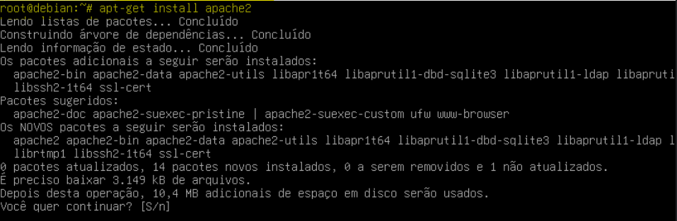
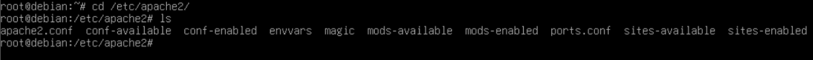
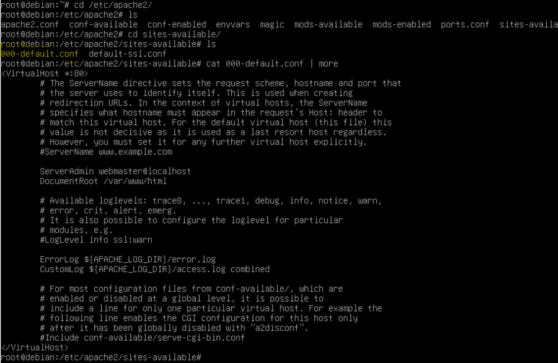
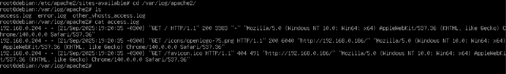
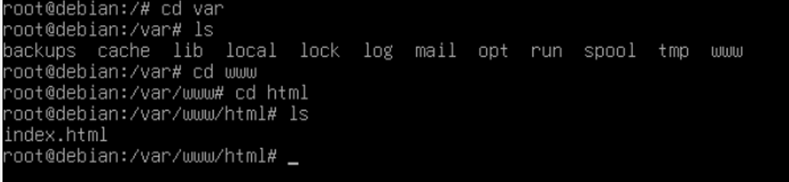
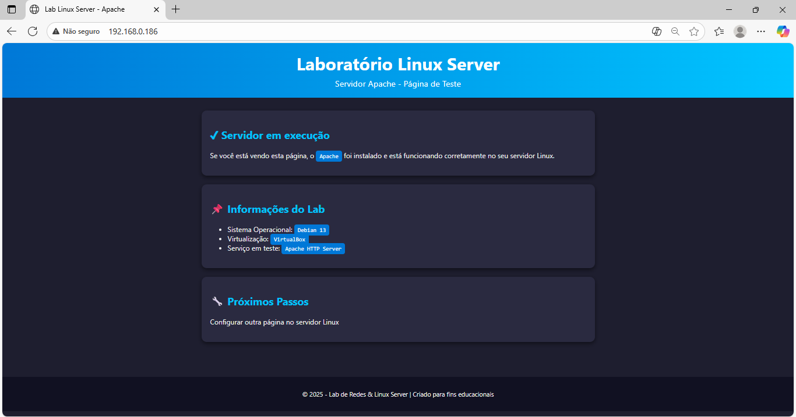

# 🛠️ Laboratório – Configuração de Servidor Web Apache no Debian

## 📘 Descrição Geral

Este laboratório demonstra o processo completo de **instalação, configuração e validação do servidor web Apache** em um ambiente **Linux Debian**, executado em uma **máquina virtual (VM)** configurada no **Oracle VirtualBox**.  
O ambiente foi projetado para simular um **cenário real de infraestrutura**, permitindo compreender a **estrutura de diretórios do sistema**, o **gerenciamento de serviços** e a **edição de arquivos de configuração** do Apache.  

Durante o procedimento, foram registradas capturas de tela (prints) e incluídas explicações objetivas sobre os comandos utilizados em cada etapa, servindo como **referência técnica** para futuras configurações e padronização de ambientes web baseados em Linux.

---

## 🎯 Objetivo

Demonstrar o processo técnico de **implantação e administração do serviço Apache** em ambiente Debian virtualizado, abordando os seguintes pontos:  
- Instalação e habilitação do pacote `apache2` via linha de comando.  
- Configuração de **VirtualHosts** e diretórios de publicação.  
- Ajuste de **permissões e propriedades** dos diretórios do servidor.  
- Validação do serviço por meio de **testes locais e análise de logs**.  
- Aplicação de **boas práticas de segurança e organização** em servidores web Linux.  
<br><br>


# 🧾 DOCUMENTAÇÃO – CONFIGURAÇÃO DO SERVIDOR APACHE NO DEBIAN 
## 🔹 1 Instalando o Apache2

### Comando

```bash
apt-get install apache2
````
Explicação
Comando instala o servidor Apache2 no Debian, resolvendo dependências automaticamente e instalando pacotes como apache2-bin, apache2-data, entre outros.

📸 Imagem: Instalação do Apache2 no Debian

<br><br>

## 🔹 2. Navegando pelo Diretório de Configuração do Apache2

### Comando

```bash
cd /etc/apache2/
ls
````

📸 Imagem: Listando diretório /etc/apache2


🔍 **Explicação rápida:**  

Agora, ao executar o comando `cd /etc/apache2/`, você acessa o diretório de configuração principal do Apache2. O comando `ls` lista os arquivos e pastas importantes, como `apache2.conf`, `ports.conf`, e os 
diretórios `sites-enabled` e `mods-enabled`, que controlam a configuração dos sites e módulos ativos no servidor.
<br><br>

## 🔹 3. Visualizando o VirtualHost Padrão

### Comando

```bash
cd /etc/apache2/sites-available/
cat 000-default.conf | more
````

📸 Imagem: Exibindo conteúdo do arquivo 000-default.conf


🔍 **Explicação rápida:**  

Neste passo, foi acessado o arquivo `000-default.conf`, responsável pela configuração do **VirtualHost padrão** do Apache na porta 80.

A diretiva `DocumentRoot` aponta para `/var/www/html`, indicando o diretório onde o site será hospedado. Esse caminho é utilizado para carregar o `index.html` padrão do Apache.

Outros pontos:

- **ServerAdmin**: define o e-mail do administrador.  
- **ErrorLog** e **CustomLog**: indicam os arquivos de log.

⚠️ Nenhuma alteração foi feita nesta configuração — já veio com o padrão definido.  
A única modificação foi no arquivo `index.html`, que será exibido no navegador.
<br><br>


## 🔹 4. Acessando os Logs do Servidor Apache

### Comando

```bash
cd /var/log/apache2/
ls
````

📸 Imagem: Listando arquivos de log em /var/log/apache2


🔍 **Explicação rápida:**  

O diretório `/var/log/apache2/` armazena os principais arquivos de log gerados pelo Apache. Esses registros são fundamentais para o **diagnóstico de erros**, **análise de acesso** e **monitoramento** do funcionamento do servidor.

Os principais arquivos são:

- **access.log**: registra todas as requisições feitas ao servidor (IP, navegador, status HTTP, etc.).
- **error.log**: armazena mensagens de erro geradas pelo Apache.
- **other_vhosts_access.log**: acessos relacionados a outros VirtualHosts configurados.

# Analisando o Arquivo access.log

### Comando

```bash
cat access.log
````

🔍 **Explicação rápida:**  
Este comando exibe o conteúdo do arquivo access.log, onde cada linha representa uma requisição HTTP recebida.

📸 Imagem: Visualizando conteúdo do access.log


### Exemplo de linha registrada:
192.168.0.204 - - [21/Sep/2025:19:20:35 -0300] "GET / HTTP/1.1" 200 3383 ...

### Informações contidas:

IP do cliente

Data e hora do acesso

Método e rota acessada (GET /)

Código de status HTTP (ex: 200 = sucesso, 404 = não encontrado)

Agente de usuário (navegador e sistema operacional)

Esses dados permitem validar se o servidor respondeu corretamente às requisições e identificar erros comuns, como o 404 ao tentar carregar /favicon.ico.
<br><br>


## 🔹 5. Verificando o Serviço Apache2 em Execução

Comandos:
```bash
ss -tl
ss -tlnp
````


📸 Imagem: Verificação das portas e processos em escuta do Apache2  

 


🔍 **Explicação rápida:**

Neste passo, utilizamos o comando `ss` (socket statistics) para verificar os **serviços e portas que estão escutando conexões** na máquina.

- O comando `ss -tl` lista as portas TCP em modo *listening*, ou seja, prontas para receber conexões.
- O comando `ss -tlnp` adiciona as opções `n` (mostra números de portas em vez de nomes) e `p` (exibe o processo associado à porta), fornecendo uma visão detalhada dos serviços ativos.

Na saída exibida, é possível identificar:

- A porta **:80** (HTTP), associada ao processo **apache2**, confirmando que o serviço está ativo e aguardando conexões.
- Outras portas como **:22** (SSH), **:139** e **:445** correspondem a serviços de rede e compartilhamento (Samba), comuns em ambientes de administração e testes.

🧠 **Análise Técnica:**
A presença do processo `apache2` escutando na porta 80 confirma que o servidor web está operacional e acessível para conexões HTTP.  
Essa validação é fundamental antes de realizar testes via navegador ou ajustar configurações de VirtualHosts.
<br><br>


##  🔹 6. Diretório da Página Web (index.html)

Comando:
```bash
cd /var/www/html/
````


📸 Imagem: Acessando o diretório padrão de hospedagem do Apache  


🔍 **Explicação rápida:**

Neste passo, navegamos até o diretório **/var/www/html/**, que é o **diretório raiz padrão** utilizado pelo Apache para armazenar as páginas web públicas do servidor.

Os comandos executados foram:

- `cd var` → acessa o diretório **/var**, onde ficam pastas de dados e logs de serviços do sistema.  
- `cd www` → acessa a pasta dedicada a serviços web.  
- `cd html` → entra no diretório onde ficam os arquivos publicados.  

🧩 **Detalhes importantes:**
- O arquivo **index.html** é a página inicial exibida quando o servidor é acessado via navegador (ex: `http://localhost` ou `http://IP-do-servidor`).
- É possível editar este arquivo com um editor de texto (como `nano` ou `vim`) para personalizar o conteúdo exibido no navegador.
- Este diretório é definido pela diretiva `DocumentRoot` no arquivo `/etc/apache2/sites-available/000-default.conf`.

🧠 **Análise Técnica:**
O caminho **/var/www/html/** representa a raiz pública do site padrão do Apache.  
Esse é o local onde são armazenados os arquivos HTML, CSS, imagens e outros recursos que compõem o site.  
Manter a estrutura organizada e com permissões adequadas é essencial para segurança e manutenção do ambiente.
<br><br>


## 🔹 7. Página Web Acessível via Navegador no Windows

📸 Imagem: Página web acessada a partir do Windows  


🔍 **Explicação rápida:**

Neste passo, validamos o funcionamento do **servidor Apache** acessando a página hospedada no Debian por meio de um **navegador no sistema Windows**, utilizando o endereço IP da máquina virtual (exemplo: `http://192.168.0.186`).

A página personalizada `index.html` foi carregada corretamente, confirmando que:

- O serviço **Apache2** está ativo e respondendo na porta **80** (HTTP).  
- O **acesso remoto** entre as máquinas (Windows → Debian) está funcionando.  
- O conteúdo HTML criado foi publicado com sucesso no diretório `/var/www/html/`.

🧩 **Detalhes técnicos:**
- O navegador exibe o título **“Lab Linux Server – Apache”**, indicando que o arquivo HTML foi editado conforme o objetivo do laboratório.  
- O aviso “Não seguro” é esperado, pois o acesso está sendo feito via HTTP (sem certificado SSL).  
- A comunicação ocorre pela rede interna do VirtualBox, utilizando um **adaptador de rede em modo Bridge** ou **Rede Interna (Host-Only)**.

🧠 **Análise Técnica:**
A exibição correta da página confirma a **entrega do conteúdo web** pelo Apache.  
Essa etapa fecha o ciclo básico de instalação e validação de um **servidor HTTP funcional** no ambiente Debian.  

